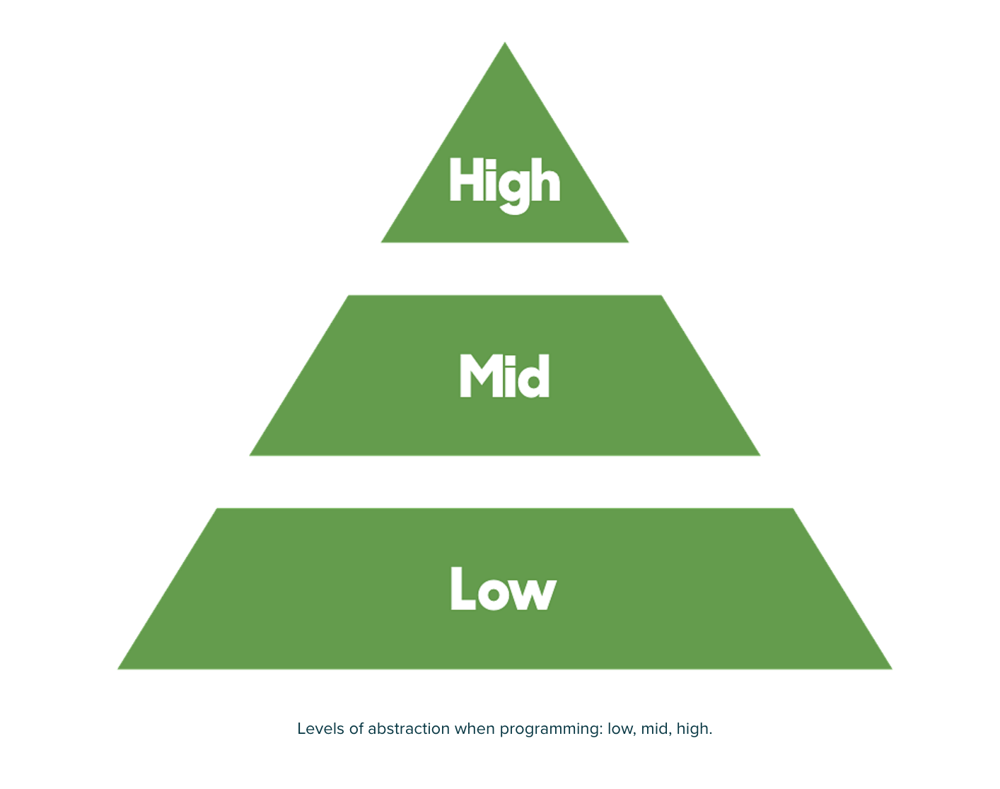
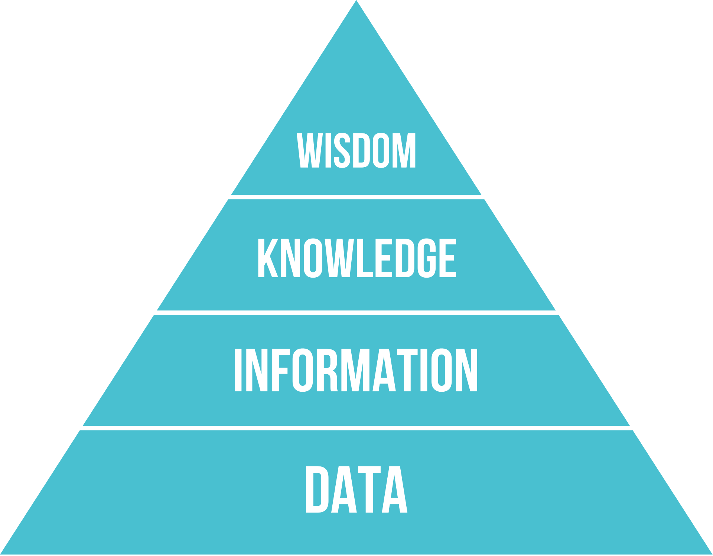

# Code & Philosophy -- Diary

### 16.2.2017
#### Guest Lecture: How and why Web App security Fails? -- Antti Virtanen @SOLITA 

> Philosophy of Security: 

> "Security is risk management."

> "If you know the enemy and know yourself, you need not fear the result of a hundred battles." -- Sun Tzu, Art of War

##### RECIPE FOR SECURE SOFTWARE:

1. Design it properly. Do the right thing. 
  * Don’t roll your own. 
    * Especially, don’t invent hash algorithms, RND or crypto!
    * Seriously. Failure imminent and certain. 
  * Follow best practices. ([best practices from Futurice](https://github.com/aprilsnows/backend-best-practices#security))
  * Understand what you are doing. 
    * Read the RFC. Understand your tools and libs.
2. Do it right (Mistake in implementation = bug = security issue)
3. Prepare for the unthinkable

Resource: [SlideShare](http://www.slideshare.net/Solita_Oy/webapp-securitytut2017), [Webhack](http://www.webhack.fi/), [google-gruyere](http://google-gruyere.appspot.com/)

Tools: [Burp prox](https://portswigger.net/burp/), [OWASP Zed Attack Proxy](https://www.owasp.org/index.php/OWASP_Zed_Attack_Proxy_Project)

Reading: [OWASP Top-10 risks](https://www.owasp.org/index.php/Top_10_2013-Top_10), [The Web Application Hacker's Handbook](https://leaksource.files.wordpress.com/2014/08/the-web-application-hackers-handbook.pdf), [Hacking: The Art of Exploitation](https://leaksource.files.wordpress.com/2014/08/hacking-the-art-of-exploitation.pdf)

---
### 10.2.2017
#### Pyramid of Proficient Programmer

Today I read an enlightening [article](http://futurice.com/careers/technical-interviews-at-futurice) from Andre Medeiros @Futurice, which stress a very thought-provoking viewpoint：

> A proficient programmer is able to think on three levels of abstraction: low, mid, high:

>**Programmers who think on the lower level** are analytical and can read code like a compiler does. They are detail oriented and know how primitive operations work in their programming language of choice. When they find a bug, they are able to pause their feature-building enthusiasm and dig deep into lower-level code until they uncover the root cause of that bug. An example question that samples your low level knowledge is: in which cases does JavaScript create a scope for variables? Got stuck with that question? No problem, we can skip it and talk about another one.

>**Programmers who think on the middle level** are doers and know they have a mission. They can imagine the software ready and plan their course of action. They know how to reuse existing libraries and integrate them in order to build features. They know how to use frameworks and libraries. They understand that business has goals and limited time, and they get things done. An example question on mid-level knowledge would be: how would you go about creating a currency converter with frontend technologies? Can you code it now?

>**Programmers who think on the high level** are architects and can organize code without necessarily seeing code. They know how different design patterns help achieve goals while keeping code maintainable. They have empathy and carefully consider how other programmers will appreciate the code structure when joining the project. When faced with a mid or low level problem, they stop to reconsider their overall approach. An example question for this level is: what kind of technical debt do you allow and what kind do you forbid?

The pyramid of programmers remind me of [DIKW pyramid](https://www.wikiwand.com/en/DIKW_pyramid#/) (Data, Information, Knowledge, and Wisdom):

 The four hierarchies of the pyramid are roughly mapping to different level of programers' proficiency. A person with only low  level programming proficiency is only good at fixing shop-floor level bugs as data is the basic signal, symbol and fact. A person with high level programming proficiency has wisdom to build the architect of software. Because wisdom is also based on knowledge and experience. The middle level proficient programmer have the information to get things done, but are constantly dependent on knowledge of others (StackOverflow or the web) when they hit bugs or technical problems, and is too young and naive to gain wisdom.  
 
 In the end, the article stressed the importance of all three level, which is also my goal of self-improvement:
 
 > The job of a software developer actually requires all three levels. Low-level programming is needed for overcoming technical obstacles and fixing bugs. Mid-level programming is vital for actually building software. High-level programming is important for troubleshooting and ensuring the future maintainability of software.

